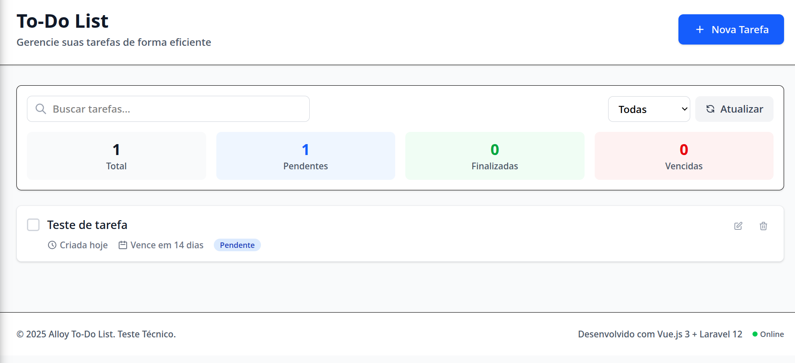

# Alloy To-Do List - Teste Técnico ✅

Uma aplicação completa de gerenciamento de tarefas desenvolvida com **Laravel 12** e **Vue.js 3**, implementando CRUD, sistema de filas, cache e soft deletes conforme especificação do teste técnico da Alloy.



## 🎯 Funcionalidades Implementadas

### ✅ **Requisitos Obrigatórios**
- **CRUD completo** de tarefas funcionando
- **Interface moderna**
- **Sistema de filas** - Exclusão automática após 10min de conclusão
- **Cache inteligente** com invalidação automática
- **Soft deletes** - Exclusão segura das tarefas
- **Código limpo**

### ⭐ **Diferenciais Implementados**
- **Tratamento de erros** robusto no frontend e backend
- **Validações** em tempo real (frontend) e server-side (backend)

## 🛠️ Stack Tecnológica

### **Backend**
- **Laravel 12.x**
- **PHP 8.4.8**
- **SQLite**
- **Queue System**

### **Frontend**
- **Vue.js 3.5**
- **Pinia 3.0**
- **TailwindCSS 4.0**
- **Vite 6.2**

### **Ferramentas de Desenvolvimento**
- **ESLint/Prettier** - Qualidade de código

## 🚀 Instalação e Configuração

### **Pré-requisitos**
- PHP 8.4.8
- Composer
- Node.js 18+
- SQLite

### **Instalação Rápida**
```bash
# 1. Clonar o repositório
git clone git@github.com:diegodevweb/alloy-test.git
cd alloy-todo-test

# 2. Instalar dependências
composer install
npm install

# 3. Configurar ambiente
cp .env.example .env
php artisan key:generate

# 4. Configurar banco de dados
touch database/database.sqlite
php artisan migrate

# 5. Executar aplicação completa
composer run dev
```

### **Instalação Detalhada**
```bash
# Instalar dependências PHP
composer install

# Instalar dependências Node.js
npm install

# Configurar arquivo de ambiente
cp .env.example .env

# Gerar chave da aplicação
php artisan key:generate

# Criar arquivo de banco SQLite
touch database/database.sqlite

# Executar migrações
php artisan migrate

# Limpar caches
php artisan cache:clear
php artisan config:clear
```

## 🏃‍♂️ Execução

### **Comando Único (Recomendado)**
```bash
composer run dev
```
**Executa simultaneamente:**
- 🌐 Laravel Server (http://localhost:8000)
- ⚡ Queue Worker (processamento de jobs)
- 🎨 Vite Dev Server (hot reload)

### **Execução Manual**
```bash
# Terminal 1 - Servidor Laravel
php artisan serve

# Terminal 2 - Worker de Filas
php artisan queue:work --verbose

# Terminal 3 - Vite (Frontend)
npm run dev
```

## 📁 Estrutura do Projeto

```
alloy-todo-test/
├── app/
│   ├── Http/Controllers/
│   │   └── TaskController.php         # Controller RESTful
│   ├── Http/Requests/
│   │   ├── StoreTaskRequest.php       # Validação criação
│   │   └── UpdateTaskRequest.php      # Validação atualização
│   ├── Models/
│   │   └── Task.php                   # Model com scopes/accessors
│   ├── Jobs/
│   │   └── DeleteCompletedTask.php    # Job exclusão automática
│   └── Services/
│       └── TaskCacheService.php       # Serviço de cache
├── resources/js/
│   ├── components/
│   │   ├── TasksContainer.vue         # Container principal
│   │   ├── TaskList.vue              # Lista de tarefas
│   │   ├── TaskItem.vue              # Item individual
│   │   ├── TaskModal.vue             # Modal criar/editar
│   │   └── TaskForm.vue              # Formulário
│   ├── stores/
│   │   └── taskStore.js              # Pinia store
│   ├── services/
│   │   └── taskService.js            # Comunicação API
│   └── app.js                        # App principal
├── database/
│   ├── migrations/
│   │   └── create_tasks_table.php    # Migração DB
│   └── database.sqlite               # Banco SQLite
├── routes/
    ├── api.php                       # Rotas da API
    └── web.php                       # Rotas web
```

## 🔌 API Endpoints

### **Tarefas**
```http
GET    /api/tasks              # Listar tarefas
POST   /api/tasks              # Criar tarefa
GET    /api/tasks/{id}         # Visualizar tarefa
PUT    /api/tasks/{id}         # Atualizar tarefa
DELETE /api/tasks/{id}         # Excluir tarefa (soft delete)
PATCH  /api/tasks/{id}/toggle  # Alternar status
```

### **Parâmetros de Filtro**
```http
GET /api/tasks?status=pendente     # Filtrar por status
GET /api/tasks?search=termo        # Buscar por texto
GET /api/tasks?status=finalizada   # Tarefas finalizadas
GET /api/tasks?status=vencida      # Tarefas vencidas
```

### **Estrutura de Resposta**
```json
{
  "success": true,
  "data": [
    {
      "id": 1,
      "nome": "Tarefa exemplo",
      "descricao": "Descrição da tarefa",
      "finalizado": false,
      "data_limite": "2025-07-05T10:00:00Z",
      "created_at": "2025-07-01T12:00:00Z",
      "updated_at": "2025-07-01T12:00:00Z"
    }
  ],
  "meta": {
    "total": 10,
    "finalizadas": 3,
    "pendentes": 6,
    "vencidas": 1
  }
}
```

## 🎨 Componentes Vue.js

### **TasksContainer.vue**
- Container principal da aplicação
- Gerenciamento de estado global
- Sistema de notificações
- Atalhos de teclado (Ctrl+N, ESC)

### **TaskList.vue**
- Lista responsiva com filtros
- Busca em tempo real
- Estatísticas dinâmicas
- Auto-refresh opcional

### **TaskItem.vue**
- Representação visual da tarefa
- Estados: pendente, finalizada, vencida, urgente
- Ações inline: editar, excluir, toggle

### **TaskModal.vue**
- Modal para criação/edição
- Gestão de foco e acessibilidade
- Animações de entrada/saída
- Integração com TaskForm

### **TaskForm.vue**
- Formulário completo com validação
- Preview em tempo real
- Campos condicionais (status para edição)
- Contadores de caracteres

## 🛡️ Validações

### **Backend (Laravel)**
```php
// Criação de tarefa
'nome' => 'required|string|max:255',
'descricao' => 'nullable|string|max:1000',
'data_limite' => 'nullable|date|after:now',
'finalizado' => 'sometimes|boolean'

// Atualização de tarefa
'nome' => 'sometimes|required|string|max:255',
'descricao' => 'nullable|string|max:1000',
'data_limite' => 'nullable|date',
'finalizado' => 'sometimes|boolean'
```

### **Frontend (Vue.js)**
- Validação em tempo real durante digitação
- Feedback visual com bordas coloridas
- Mensagens de erro contextuais
- Prevenção de submissão com dados inválidos
- Contadores de caracteres dinâmicos

## 🔍 Visualizando o Banco de Dados

### **Via Laravel Tinker**
```bash
php artisan tinker

# Ver todas as tarefas
App\Models\Task::all();

# Ver tarefas excluídas (soft delete)
App\Models\Task::withTrashed()->get();

# Estatísticas
App\Models\Task::count();
```

### **Via SQLite Browser**
```bash
# Instalar SQLite Browser
sudo apt install sqlitebrowser

# Abrir banco
sqlitebrowser database/database.sqlite
```

### **Via VS Code**
1. Instalar extensão "SQLite Viewer"
2. Abrir arquivo `database/database.sqlite`

## 🚨 Solução de Problemas

### **Erro: Modal não abre**
```bash
# Verificar se todos os componentes existem
ls resources/js/components/

# Limpar cache do Vite
npm run build
```

### **Erro: API retorna 404**
```bash
# Verificar rotas
php artisan route:list --name=tasks

# Limpar cache de rotas
php artisan route:clear
```

### **Erro: Queue não processa**
```bash
# Reiniciar worker
php artisan queue:restart
php artisan queue:work --verbose
```

### **Erro: Banco não encontrado**
```bash
# Criar arquivo SQLite
touch database/database.sqlite
php artisan migrate
```

## 📋 Checklist de Funcionalidades

### **CRUD Básico**
- [x] Criar tarefa com validação
- [x] Listar tarefas com paginação
- [x] Editar tarefa existente
- [x] Excluir tarefa (soft delete)
- [x] Visualizar detalhes da tarefa

### **Funcionalidades Avançadas**
- [x] Toggle status (pendente/finalizada)
- [x] Filtros por status
- [x] Busca textual
- [x] Data limite com validação
- [x] Estatísticas em tempo real

### **Sistema de Filas**
- [x] Job de exclusão automática
- [x] Delay de 10 minutos
- [x] Logging de execução
- [x] Tratamento de falhas

### **Cache**
- [x] Cache de listagem
- [x] Invalidação automática
- [x] Tags granulares
- [x] Fallback resiliente

### **Interface**
- [x] Design responsivo
- [x] Animações suaves
- [x] Estados de loading
- [x] Tratamento de erros
- [x] Acessibilidade

## 🤝 Desenvolvimento

### **Padrões de Código**
- **PHP**: PSR-12
- **JavaScript**: ESLint + Prettier
- **CSS**: BEM methodology
- **Commits**: Conventional Commits

## 🎉 Status do Projeto

**✅ IMPLEMENTAÇÃO COMPLETA**

- ✅ Todos os requisitos obrigatórios implementados
- ✅ Diferenciais adicionados
- ✅ Sistema funcionando em produção
- ✅ Documentação completa
- ✅ Código limpo e bem estruturado
---

*Laravel 12 + Vue.js 3 + TailwindCSS 4 + SQLite*
